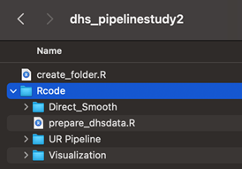
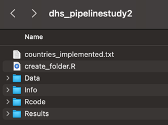
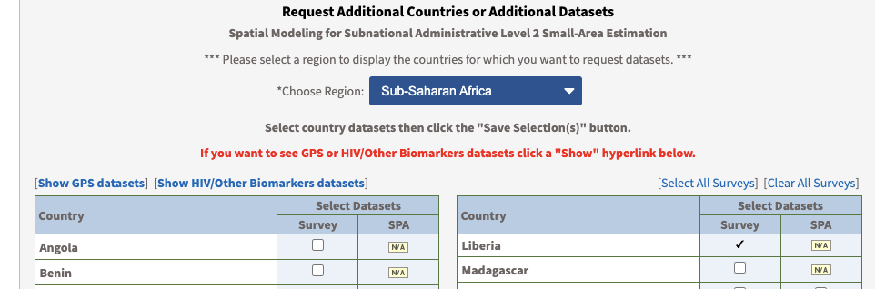
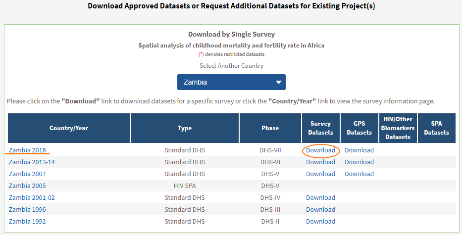
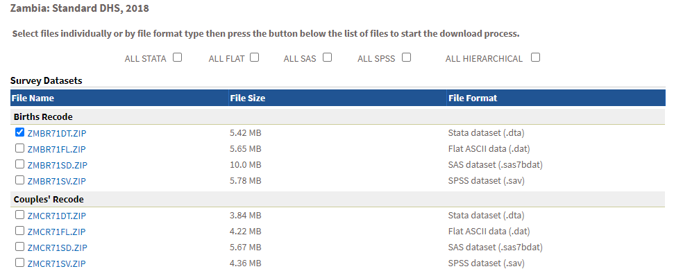
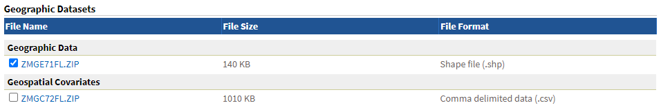
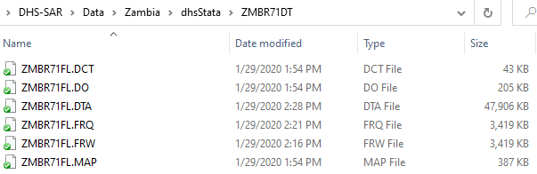
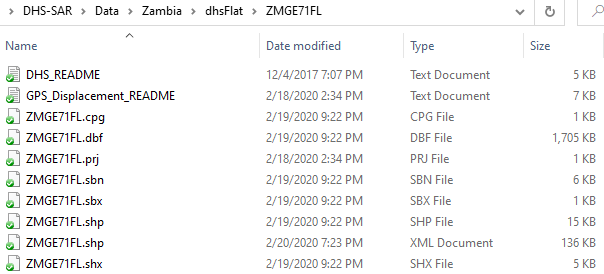
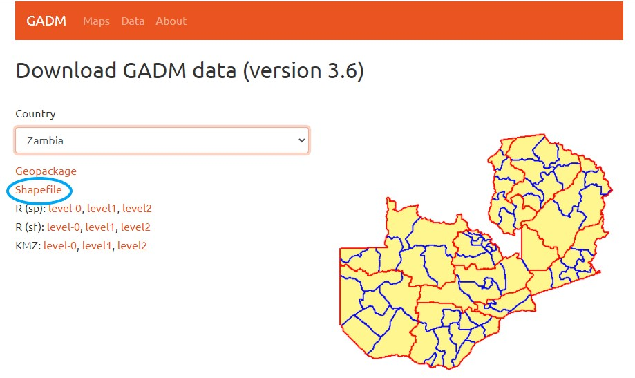
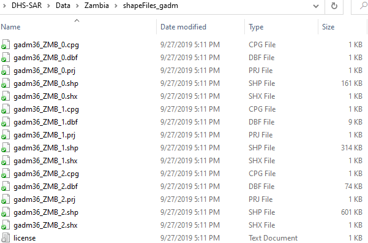

# Pipeline Overview and Data Source


## Summary

In this document, we give an overview of the pipeline and suggest the order at which scripts are run.
In addition, we summarize the main data source for U5MR pipeline, specifically on shapefile and DHS data.  For preparation of population rasters, please reference the vignette 'Urban Fraction for Stratified Beta-binomial Model'. The R scripts and vignettes are hosted under Github repo https://github.com/wu-thomas/SUMMER-DHS/. 
Note that our pipeline is **not** aimed to replicate the estimates presented in DHS final report. Due to distinctions in methods, our estimates will **not** be exactly the same as DHS estimates, but they will be consistent.  For replicating estimates in DHS report, please use R package DHS.rates. 

## Pipeline Overview

The pipeline is structured as three parts: 
 
1. Obtaining direct and smoothed direct estimates. They are standard ways of estimating U5MR at national or Admin-1 level, but they could hardly compute Admin-2 level estimates for the reasons described in the main report. They serve as comparisons for our beta-binomial model estimates. The scripts are under 'Rcode/Direct_Smooth'.

2. Stratified beta-binomial model is our main approach for analysis. The scripts are under 'Rcode/UR Pipeline'. We first calculate urban fractions for under 5 population, then fit stratified model and finally get the overall aggregated estimates. More details could found in another vignette, 'Urban Fraction for Stratified Beta-binomial Model'.

3. Scripts that produce maps and figures are under 'Rcode/Visualization'. We provide scripts for the set of figures shown in the main report and appendix.  

The detailed instruction about implementing the scripts in order is:

0. Make sure your R version is at least 4.1.0 (also RStudio is using R 4.1.0 or more recent version). Otherwise, installation of dependent packages might fail. 

1. Create a new directory and put the entire folder "Rcode" and the script named "create_folder.R" into the directory. After this step, the folder structure will look like: 


<p align="center">
  
</p>

2. Run "create_folder.R" in Rstudio. Make sure to specify the country in the top section of the script. This creates the folder structure to save data and results. After this step, the folder structure will look like: 

<p align="center">
  
</p>


3. Gather the source data for the DHS surveys and GADM shapefiles described in sections 3 and 4, respectively, of this document. Put them into the folder named "Data".

4. Specify the first and last years of interest, the year of the national census sampling frame, DHS survey year and the DHS file name in the top section of "Rcode/prepare_dhsdata.R". Then proceed to run the script.

5. Run "Rcode/Direct_Smooth/Direct_SmoothDirect.R" to obtain direct and smoothed direct estimates.

6. First, navigate to “Vignette/Urban Fraction/get_urban_fraction” through Github and follow the instructions on this page. 
Next, we will run scripts under “Rcode/UR Pipeline” sequentially. Run them in the following order:

   + “prepare_thresh.R”
   
   + “ur_frac.R” (if necessary)

   + “thresh.R”

   + “stratified_BB8.R”

  The first three scripts prepare the data for the stratified beta-binomial model, and the final script fits the model and generates the estimates.  

7. To replicate the plots in the DHS report, run scripts in the folder named "Rcode/Visualization". "3UR_ratio_report.R"  produces Figure X.4 in the appendix of the main report. "compare_report.R" creates Figure X.2 in the appendix of the main report. "report_main.R" generates the rest of figures appeared in the appendix.  All figures are stored under "Results/country/Figures/Report".

We use R to conduct all the statistical analysis. Packages and dependencies could be installed as following through the pipeline. Most packages are found under cran. For two important packages '**INLA**' and '**SUMMER**', we recommend using the following installing approach. The two packages are constantly being updated. For installation related issues, please visit https://github.com/hrue/r-inla/issues or contact us.


```r
### install INLA
if (!isTRUE(requireNamespace("INLA", quietly = TRUE))) {
  install.packages("INLA", repos=c(getOption("repos"), 
                  INLA="https://inla.r-inla-download.org/R/stable"), dep=TRUE)
    
### SUMMER
library(devtools)  # install.packages("devtools")
devtools::install_github("richardli/SUMMER")
```


## DHS Survey Data

We need the BR (birth) recode for the DHS survey for U5MR estimation. To obtain the data, one needs to register first at the DHS website (https://dhsprogram.com/). After submitting a data request with description for the project, the data will be available to the user within days. When requesting DHS data, please make sure to check the "Show GPS datasets" option to request GPS data along with survey data. The interface should look like the following image. 

<center>



</center>


Both the survey data and associated GPS data serve as input for SUMMER preprossing scripts. The user could navigate to the interface below and proceed to data download. Here we use Zambia as an example.

<center>



</center>


The BR recode data should be downloaded in the Stata format and the GPS dataset can be found when scrolling down. The name of the data set will be similar as shown in the figures below.


<center>



</center>


<center>



</center>

After the zipped files are downloaded, they should be unzipped and slotted manually into the prespecified folders. The BR recode data in Stata format need to go in the folder 'Data/country/dhsStata'. A subfolder need to be created with the same name as shown on the website. In the Zambia example, it is 'ZMBR71DT', and unzipped files go under it. The GPS data should be placed in the 'Data/country/dhsFlat' folder. Similarly, unzipped files go into a subfolder with name shown on the website. In Zambia example, it is 'ZMGE71FL'. The correct folder structure is shown in the following screenshots. 


<p align="center">
  
</p>


<p align="center">
  
</p>


## GADM shapefile

The boundary shapefiles are needed for constructing subnational U5MR estimates. We use GADM shapefiles for the geography of Admin-1 and Admin-2 regions. The user could visit https://gadm.org/download_country_v3.html and enter the country of interest. By clicking 'Shapefile' as shown below, the zipped shapefiles will be downloaded. The preparation is completed by slotting the unzipped file in the folder 'Data/country/shapeFiles_gadm'. An example folder structrue is shown below. One should check the GADM shapefile is consistent with desired definition for Admin-1 and/or Admin-2 regions. If not, the shapefiles need to be prepared separately.


<p align="center">
  
</p>

<p align="center">
  
</p>


