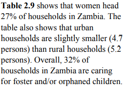

```{r setup, include=FALSE}
knitr::opts_chunk$set(echo = TRUE)
```


# Summary

Stratified beta-binomial model produces estimates separately for urban and rural. An aggregation step is needed for obtaining overall estimates. Details of urban/rural stratification and entire procedure of aggregation could be found at section 3.4 and 3.5 in the original report. We recommend the reader to go over those sections before following the steps in this note. As summarized in the following equation, the beta-binomial model generates strata specific U5MR estimates and we need the urban/rural proportion for the under 5 population $q_{i,t}$ and $1-q_{i,t}$ for all region $i$ and time $t$ to obtain the final overall estimates. 

$$p_{i,t} = q_{i,t} \times U5MR_{i,t,R} + (1-q_{i,t} ) \times U5MR_{i,t,U} $$

The complete algorithm of finding those proportions.is implemented in two scripts: prepare_thresh.R, thresh.R and they should be run in the order listed. This vignette focuses on finding and downloading the data and highlights some of the major steps.


\newpage 

# Data Source

We need population density surfaces from worldpop (related scripts are prepare_thresh.R) and Admin-1 level urban population proportion (related scripts in thresh.R).

## 1km $\times$ 1km raster for whole population at the year of census

This raster is used for determining the pixel level urban/rural classification for the country of interest. To be consistent with the stratification, we want to use the surface at the year of the sampling frame construction. The year is usually the most recent census and it could be found in the DHS report. The population raster could be manually downloaded from https://www.worldpop.org/geodata/listing?id=75 (unconstrained individual countries 2000-2020 UN adjusted, 1km resolution). The name of the downloaded raster should be like 'xxx_ppp_2000_1km_Aggregated_UNadj.tif' where xxx is the three-letter abbreviation for the country (e.g. zmb for Zambia). Then the .tif file should be manually placed into the folder 'Data\\Zambia\\Population'. Alternatively, the automated downloading scripts is:

```{r, eval=FALSE}

## pop.abbrev and pop_dir are prespecified in the scripts 
setwd(pop_dir)

file <- paste0( pop.abbrev,'_ppp_',census.year,'_1km_Aggregated_UNadj.tif')

if(!file.exists(file)){
  
  url <- paste0("https://data.worldpop.org/GIS/Population/Global_2000_2020_1km_UNadj/", 
                census.year, "/", toupper(pop.abbrev),"/",      
                pop.abbrev,'_ppp_',census.year,'_1km_Aggregated_UNadj.tif')
  
  download.file(url, file, method = "libcurl",mode="wb")
}


```


## 100m $\times$ 100m raster for under-5 population at the years for estimation

These rasters are used for aggregating strata specific U5MR. We use worldpop population density broken down by age and sex (available at https://www.worldpop.org/geodata/listing?id=30). For each year, four rasters are needed: 0-1 male (xxx_m_0_year.tif), 1-5 male (xxx_m_1_year.tif), 0-1 female (xxx_f_0_year.tif) and 1-5 female (xxx_f_1_year.tif), where xxx is the three-letter abbreviation for the country. For estiamtes in the past 9 years, 36 rasters in total should be donwloaded. Because of website constraint, the automated downloading scripts might not work well. In that case, manually downloaded .tif files should be put into the folder 'Data\\Zambia\\Population'. The automated downloading scripts is:


```{r, eval=FALSE}

#! downloading might take a long time, especially for big countries

pop.year <- beg.year:end.year  ## population surface year

setwd(pop_dir)

options(timeout = 1000) # adjust this time, should be longer than each download
for(year in pop.year){ 
  print(year)
  for(age in c(0, 1)){
    for(sex in c("f", "m")){
      file <- paste0(pop.abbrev,'_', sex, '_', age, '_', year,'.tif')
      if(!file.exists(file)){
        url <- paste0("https://data.worldpop.org/GIS/AgeSex_structures/Global_2000_2020/", 
                      year, "/", toupper(pop.abbrev), "/", pop.abbrev, "_", 
                      sex, "_", age, "_", year, ".tif")
        download.file(url, file, method = "libcurl",mode="wb")
      }
    }
  }
}

```


## Admin-1 level urban population fraction

The thresholding algorithm requires knowledge of urban fraction at admin-1 level. Such information could usually obtained from the DHS reports, or census summary tables. We aim to prepare a cleaned table with one column indicating the Admin-1 region name and another column the urban population fraction. Note that this step involves country specific treatment and needs extra consideration. The general search process is summarized below and the options are ordered by their priority. We illustrate the process using Zambia 2018 as an example.

1. We recommend the reader to first check out the DHS report of that specific survey. Ideally, the sampling frame information will appear in appendix A. However, in our example, the admin-1 level urban population fraction is not available, and we only have household urban fraction (report available at https://dhsprogram.com/pubs/pdf/FR361/FR361.pdf). 

2. The second option is to check out the report for an earlier DHS survey for the same country. DHS surveys usually use the same sampling frame as the most recent census. As the census is less frequent than DHS surveys, it is likely (but not necessarily) that multiple DHS surveys share the same sampling frame. One should be cautious about using this approach as the sampling frame might be updated between surveys (such as in Nigeria).  In our example, we will go through the final report for DHS 2013-2014 in Zambia ( available at https://dhsprogram.com/pubs/pdf/FR304/FR304.pdf). This time, we found the information in table A.1.

<center>


</center>


3. If the DHS survey uses the same sampling frame as a census, summary report for that census might contain Admin-1 urban fraction. From table 2.3 in the summary report for Zambia census 2010, we obtain the same information.


<center>


</center>


4. The last option is to weight the number of households in urban/rural by urban/rural specific average household sizes. This approach is not ideal because the average household sizes are usually only available at national level and rounding will further compromise the accuracy. In the Zambia 2018 example, we might find information from Table A.1 and Figure 2.9 in the DHS Zambia 2018 report.  

<center>


</center>


<center>



</center>

\newpage

After the Admin-1 urban population fractions are located, we will conduct ad hoc data cleaning to prepare a data frame. We recommend first copy the table from report into a .txt file and clean it in R. The .txt file should be placed under '\\Data\\country\\'. We show some details of this step using Zambia as an example. Note that additional scripts might be needed to accommodate country specific situation. 

Generally, population counts in the table will be displayed with comma. The following scripts get rid of those commas.

``` {r, eval=FALSE}

frame<-read.delim(paste(country.abbrev, "frame_urb_prop.txt", sep = "_"),
                  header = FALSE,sep=' ')

# identify column for fraction (need additional processing in general)
frame[,c(2,4)] <- lapply(frame[,c(2,4)],   ## function to remove comma in numbers
                         function(x){as.numeric(gsub(",", "", x))})
frame$frac <- frame$V4/frame$V2


```

Another difficulty is to match the Admin-1 regions names from the table and from the GADM shapefile. A greedy algorithm might be adopted to automate the matching process. It could also be done manually.


``` {r, eval=FALSE}

# greedy algorithm to match admin names 
adm1.ref <- expand.grid(tolower(frame$V1),
                        tolower(admin1.names$GADM)) # Distance matrix in long form
names(adm1.ref) <- c("frame_name","gadm_name")
### string distance,  jw=jaro winkler distance, try 'dl' if not working
adm1.ref$dist <- stringdist(adm1.ref$frame_name,
                            adm1.ref$gadm_name, method="jw") 

greedyAssign <- function(a,b,d){
  x <- numeric(length(a)) # assgn variable: 0 for unassigned but assignable, 
  # 1 for already assigned, -1 for unassigned and unassignable
  while(any(x==0)){
    min_d <- min(d[x==0]) # identify closest pair, arbitrarily selecting 1st if multiple pairs
    a_sel <- a[d==min_d & x==0][1] 
    b_sel <- b[d==min_d & a == a_sel & x==0][1] 
    x[a==a_sel & b == b_sel] <- 1
    x[x==0 & (a==a_sel|b==b_sel)] <- -1
  }
  cbind(a=a[x==1],b=b[x==1],d=d[x==1])
}

match_order<-data.frame(greedyAssign(adm1.ref$frame_name,
                                     adm1.ref$gadm_name,
                                     adm1.ref$dist))

```


Finally, a cleaned reference table will be created with one column containing Admin-1 region names consistent with GDAM and another column containing urban population fraction. We urge the user to check the resulting data set for mismatch.

``` {r, eval=FALSE}

# create reference table 
ref.tab <- admin1.names
ref.tab$matched_name <- frame$V1[match_order$a] ### check!!!
ref.tab$urb_frac <- frame$frac[match_order$a] 

```

# Checking Accuracy of Thresholding

The thresholding algorithm will yield a pixel level classification map for urban rural status. As a sanity check, we could use this map to assign the sampled clusters to urban/rural, and then compare with the classification (stratification) used in the survey.

In DHS surveys, the true precise locations for clusters are not given for confidentiality. Instead, we only observe the jittered version of the locations. This is potentially disruptive to our classification results as the urban cluster might be moved to a rural area. There is a section called 'Correct urban cluster' in the scripts prepare_thresh.R, where we move urban clusters to more populated pixel to alleviate the side effect of jittering. 

The user could also choose to validate using uncorrected locations, though some modifications for the scripts are required.


